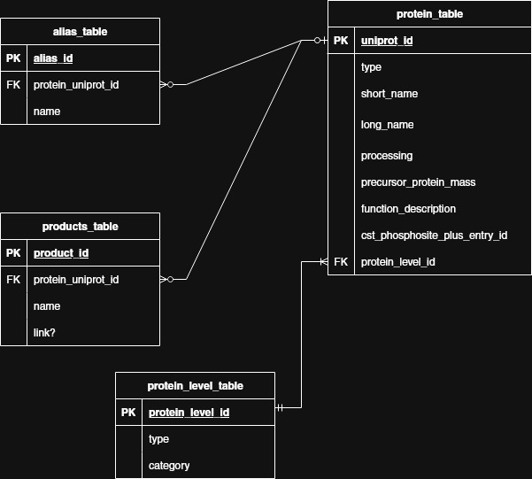

# Schemas 

## Terminology Clarification

Dr. Pelech likes to refer to his csv file as a 'database' as well as the individual sheets within the csv (labelled 'Table A' to 'Table E'). For consistency and to hopefully avoid confusion, we will use the following terminology from here onwards:

`Table`

: Refers to a table within a database. 

`Sheet`

: Refers to a sheet within a csv file. Usually labelled within the file as 'Table [letter]'.

`Database`

: Refers to the SQlite database. Not the csv file or anything inside it. 

`Schema`

: Refers to the schema(database) within SQlite that contains the tables from ONE of the csv sheets. E.g. Schema A contains the data from sheet A, but contains multiple tables. 

`The CSV`

: Refers to the data given to us by Dr. Pelech. Raw csv. 

## ERD Setup

Based on the DB structure file given to us and the data from the csv's, we put together 1 ERD for each
sheet. We decided on 5 separate ERD's instead of 1 large ERD because of the way the data 
is given to us. The data in the csv files is put together in a way that makes it unnecessary for communication between different sheets in the csv. We *could* have made one large ERD, but that would rely on a very specific INSERT statement and ordering the data when inserting it and ... it would be very complicated. We also could have done what some previous teams have done and have no database and write code to take data directly from the csv and display it on the front end. We wanted to apply our skills *somehow* so this is our middle ground.

## Schema A

## Schema B

## Schema C

## Schema D

## Schema E

